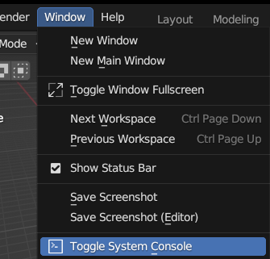
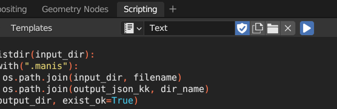

# AniMo4D Dataset Export Guide

This guide outlines the steps to export animal model and animation data from game, ultimately converting it into a structured `.json` format for the AniMo4D dataset.

First, you need to execute the following:

```bash
cd ./data_generation/export_json
git clone https://github.com/OpenNaja/cobra-tools.git
cp AniMo_export_ovl.py cobra-tools
```

## 📁Project File Structure

```
.
├── AniMo_blender_ovl2json.py
└── cobra-tools/
    ├── AniMo_export_ovl.py
    └── ... (other cobra-tools files and subdirectories)
```

## Prerequisites

### 1. Game Installation

Ensure Game is installed via Steam. The required `.ovl` files are typically located in:
`C:/Program Files (x86)/Steam/steamapps/common/[Replace with your game]/win64/ovldata`
*(Note: Your Steam installation path might differ.)*

### 2. Dependencies Installation

**Platform:** Windows 10 / Windows 11

**📦a. Create and Activate Conda Environment:**

```bash
conda create -n cobra python=3.11
conda activate cobra
```

**📥b. Install Python Packages:**

```bash
pip install numpy bitarray
```

**🐍c. Install Cobra Tools Core Components:**
Navigate to the `cobra-tools` directory:

```bash
cd cobra-tools
```

Run the GUI tool once to trigger the setup for essential components:

```bash
python ovl_tool_gui.py
```

Then press `Y` and Enter to install.

## Export Process

### Step 1: Extract `.ms2` and `.manis` from `.ovl` files

**[Game `.ovl` files] -> [`.manis` & `.ms2` files]**

This step uses `cobra-tools` to extract animal model (`.ms2`) and animation (`.manis`) files from game's `.ovl` archives.

1. 🐍Ensure you are in the `cobra-tools` directory:

   ```bash
   cd cobra-tools
   ```
2. ▶️Run the export script:

   ```bash
   python AniMo_export_ovl.py
   ```

   **Important:** Before running, you **must** edit `AniMo_export_ovl.py` to:

   * Set the correct path to your game `ovldata` directory.
   * Specify the desired output directory for the extracted `.ms2` and `.manis` files.

### Step 2: Convert `.ms2` and `.manis` to `.json`

**[`.manis` & `.ms2` files] -> [`.json` files]**

This step uses Blender (version 3.6) with its Python interface (`bpy`) to convert the extracted files into structured skeletal motion data in `.json` format.

1. 💻**Open Blender 3.6.**
2. ⌨️**Open Blender's System Console:** This is crucial to prevent Blender from freezing and to see script output or errors.

   * Go to `Window > Toggle System Console`.
     
3. ▶️**Load and Run the Conversion Script:**

   * Navigate to the `Scripting` tab in Blender.
   * Click `New` to create a new text block.
   * Copy the entire content of `AniMo_blender_ovl2json.py` (located in the root of this project) and paste it into Blender's text editor.
   * **Important:** Before running, you **must** edit the script within Blender's text editor to:
     * Set the correct input directory path (where your `.ms2` and `.manis` files are located from Step 1).
     * Specify the desired output directory for the generated `.json` files.
   * Click the `Run Script` button (triangle icon) in the text editor header.
     
4. ⚠️**Execution Note:**

   * **WARNING:** Once the script starts running, **DO NOT** interact with the Blender GUI. Doing so can cause Blender to freeze or crash.
   * You can monitor the script's progress and any messages in the System Console window you opened earlier.
   * The generated `.json` files will be saved to the output directory you specified within the script.
